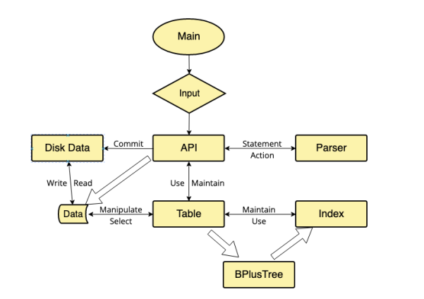

# Readme

手写数据库内核：



**parser.py：**对基础sql进行解析，包含WHERE, ORDER BY, GROUP BY, LIMIT的单个或组合，以及各类聚合函数如（SUM, MIN, MAX, COUNT） 等的解析

**table.py:** 数据表类型，包含一切可能的对于数据表的操作，除了CRUD之外，支持链接（join），建立索引等。

**api.py:** 通过继承CMD类从而创建的自己的cmd，提供“commit”命令，将内存中的资源写入本地，再插入或删除大量数据后请及时“commit”。

索引的搜索完全基于b+树，也提供了C++的版本，争取日后可以完全用C++复现该项目。

b+树的使用方面，在所有的primary key上都会自动添加索引，不会在插入/删除每一条数据后改变b+树的结果，而是使用“commit”命令后一次性更改，因为在测试插入10w条数据的时候，发现动态的更新非常影响插入速度。

### 使用：

```cmd
./main.py
```

提供了可执行的testcase。

### 测试：

testcase可以复制直接运行。

这里展示索引的加速：


可以看到在搜索近10w的数据时，索引加速了近10倍。# MyTinyDBMS
